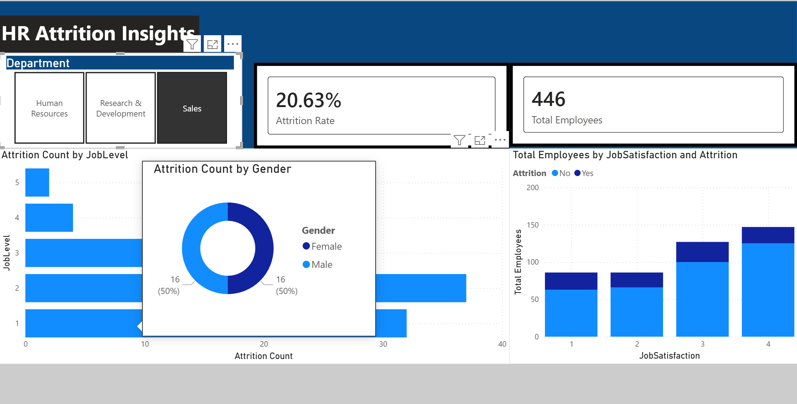
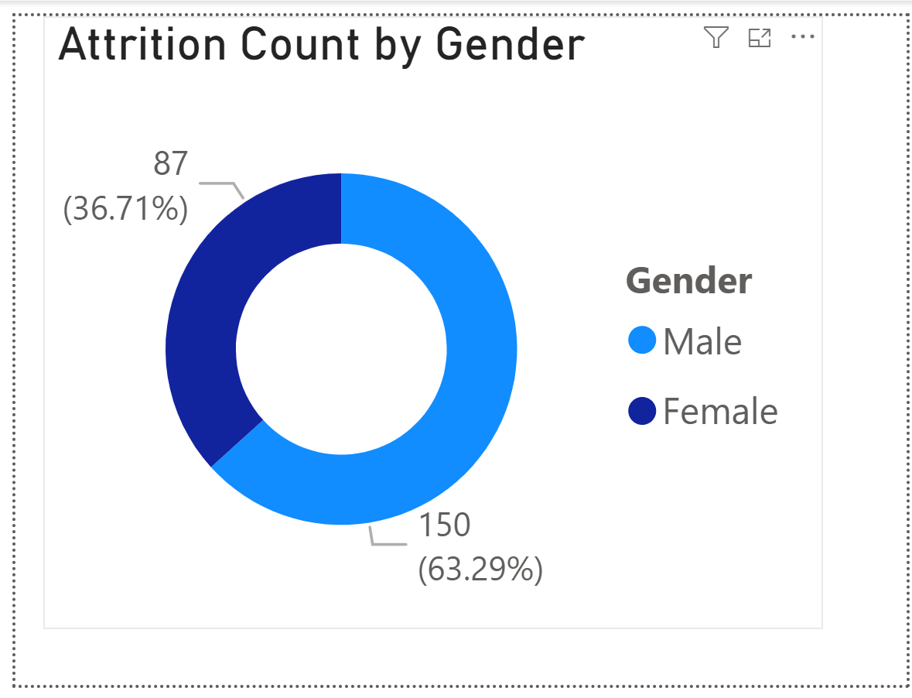

# HR Employee Attrition Dashboard (Power BI)

## Project Overview
This project analyzes a simulated HR dataset to uncover the primary factors driving employee attrition. The analysis was conducted in Power BI, utilizing custom DAX measures to track attrition rates and interactive visualizations to identify high-risk employee cohorts. The goal is to provide actionable intelligence to improve retention strategies.

### 📂 Repository Structure
- **`HR_Data_Analysis.pbix`**: The complete Power BI dashboard file containing the data model, DAX measures, and visualizations. *(Start here!)*
- **`HR-Employee-Attrition.csv`**: The raw dataset used for the analysis.
- **`images/`**: Folder containing high-resolution screenshots of the dashboard interface.

---

## Dashboard Visualizations

### Main Dashboard View

### Interactive Tooltip Analysis

## Key Business Insights

* **Role-Specific Flight Risk:** Sales Representatives demonstrate the highest volume of attrition compared to all other job roles in the organization.
* **Satisfaction Correlation:** Employees reporting a Job Satisfaction score of '1' represent a disproportionately high segment of the churned population. 
* **Gender Breakdown:** Utilizing custom report tooltips reveals the specific demographic breakdown of attrition within individual departments, allowing for targeted retention programs.

## Technical Skills Demonstrated

* **Data Modeling:** Imported and structured raw CSV data for optimal reporting performance.
* **DAX Formulas:** Authored custom measures for total headcount, attrition count, and attrition rate percentages.
* **UI/UX Design:** Built a custom navigation layout and applied consistent corporate styling for readability.
* **Advanced Interactivity:** Implemented slicers for cross-filtering and designed custom report page tooltips to provide secondary data context without overcrowding the main canvas.
